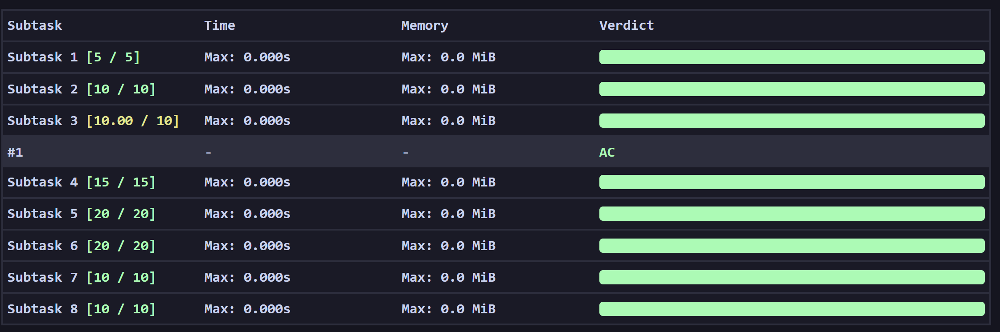

# Output-Only Tasks

A rare type of problem where you can run a heuristic solution using 12 cpu cores and avx-512 for the full time of FARIO.

Test data is probably not that useful then, so I'm just including screenshots to show how ragey they are to AC instead of 99.99 or 100.00...

